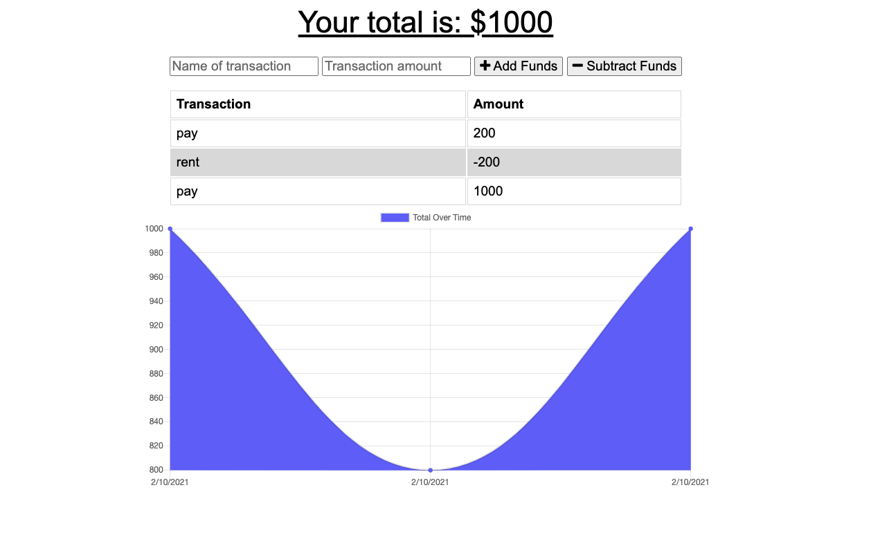

# budget-tracker

>## Description 

* Add expenses and deposits to a budget with or without an internet connection.
* #### Story
    * AS AN avid traveller,
    * I WANT to be able to track my withdrawals and deposits with or without a data/internet connection.
    * SO THAT my account balance is accurate when I am traveling.

 

>## Table of Contents

* [Contributing](#Contributing)
* [Description](#Description)
* [Installation](#Installation)
* [License](#License)
* [Questions](#Questions)
* [Story](#Story)
* [Testing](#Testing)
* [Usage](#Usage)
 

 

 

>## Product

* [Check it out!](https://dashboard.heroku.com/apps/sjf-budget-tracker-2021) 

 

>## Installation

1. Open in browser
2. Add page to homescreen
3. Open app and use with or without internet connection

 

>## Usage

1. Add debits and credits
2. Follow the graph to track your finances

 

>## Contributing

* [Submit bugs and feature requests](https://github.com/samuelfox1/budget-tracker/issues)
* [Review changes](https://github.com/samuelfox1/budget-tracker/pulls)
* [Contributor Covenant Code of Conduct](./assets/utils/CodeOfConduct.md)

 

>## Questions

| Name | Email  | Github  | LinkedIn |
| :--: | :----: | :-----: | :------: |
| Samuel Fox | samueljasonfox@gmail.com |  |  |

 

>## License

MIT License

Copyright 2021 Samuel Fox

Permission is hereby granted, free of charge, to any person obtaining a copy of this software and associated documentation files (the "Software"), to deal in the Software without restriction, including without limitation the rights to use, copy, modify, merge, publish, distribute, sublicense, and/or sell copies of the Software, and to permit persons to whom the Software is furnished to do so, subject to the following conditions:

The above copyright notice and this permission notice shall be included in all copies or substantial portions of the Software.

THE SOFTWARE IS PROVIDED "AS IS", WITHOUT WARRANTY OF ANY KIND, EXPRESS OR IMPLIED, INCLUDING BUT NOT LIMITED TO THE WARRANTIES OF MERCHANTABILITY, FITNESS FOR A PARTICULAR PURPOSE AND NONINFRINGEMENT. IN NO EVENT SHALL THE AUTHORS OR COPYRIGHT HOLDERS BE LIABLE FOR ANY CLAIM, DAMAGES OR OTHER LIABILITY, WHETHER IN AN ACTION OF CONTRACT, TORT OR OTHERWISE, ARISING FROM, OUT OF OR IN CONNECTION WITH THE SOFTWARE OR THE USE OR OTHER DEALINGS IN THE SOFTWARE.

 

The images found in 'assets/images/logo/' are trademarks of their respective companies and are under their terms and license.
 

2021
 

>## [Top of page](#budget-tracker)
